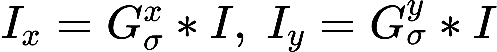

# VFX HW2 REPORT
> B05901003 電機三 徐敏倩
> B06901062 電機三 陳彥霖

## Introduction
This is our report for Homework2, NTUCSIE VFX 2020. In this homework, we construct a panorama from multiple images. This project consists of three parts. We first apply **Inverse Warping** to project the images on the cylindrical coordinate system. Then we implement **Harris corner detector** algorithm for feature detection and feature matching. Finally we implement **RANSAC** algorithm and **Linear Blending** to stitch all the images together. 

## Requirements
1. Python3
2. Python packages:
    + **cv2**
    + **numpy**
    + **matpotlib.pyplot**
    + from **tqdm** import **tqdm**
    + from **scipy.ndimage** import **filters**

## How to reproduce our result
```
bash hw2.sh all [image directory] [output directory for warped images]
```
The program will save warped images into the output directory, and will save the panorama (called final.jpg) in the root directory.
## Original Images
We tried two image sets in this project:
### Data1

|  |  |  |  |
| -------- | -------- | -------- | --- |
|  |  |  |  |


### Data2


|  |  |  |
| -------- | -------- | -------- |
|  |  |  |

## Warping
> To enhance the quality of feature matching, we decided to warp the image to cylindrical coordinate before doing feature detection.
 
We implement **Inverse Warping** for this process.
1. For every pixel on the new image(in cylindrical coordinate), calculate where its color should come from on the original picture by:
    + <!-- $x = f*tan(x'/f)$ --> 
    + <!-- $y = y'*\sqrt{x^2+f^2}/f$ --> 
    
    where `x',y'` are coordinates from the new image, `x, y` are coordinates from the source image, and f is focal length.

2. Use **Bilinear interpolation** to do resampling from nearby pixels and deal with possible aliasing


## Corner Detection
To detect features, we implement `Harris Corner Detection`.
1. Convert the image to grayscale
	+ use `cvtColor` in `opencv`
2. Compute <!-- $S_{x^2},\ S_{y^2},\ S_{xy}$ -->   for each pixel
	1. x and y derivatives of image
		+ <!-- $I_x = G_{\sigma}^x * I,\ I_y = G_{\sigma}^y * I$ --> 
		+ where `I` is the grayscale image
	2. product of derivatives
		+ <!-- $I_{x^2} = I_x \cdot I_x,\ I_{y^2} = I_y \cdot I_y,\ I_{xy} = I_x \cdot I_y$ --> 
	3. sums of the products of derivatives, $S_{x^2},\ S_{y^2},\ S_{xy}$
		+ <!-- $S_{x^2} = G_{\sigma '} * I_{x^2},\ S_{y^2} = G_{\sigma '} * I_{y^2},\ S_{xy} = G_{\sigma '} * I_{xy}$ --> 
3. Compute the corner response value for each pixel
	+ <!-- $M(x, y) = \begin{bmatrix} S_{x^2}(x, y) & S_{xy}(x, y)\\ S_{xy}(x, y) & S_{y^2}(x, y)\\ \end{bmatrix}$ --> 
	+ <!-- $det\ M = S_{x^2} * S_{y^2} - S_{xy}^2,\ trace\ M = S_{x^2} + S_{y^2}$ --> 
	+ let `k = 0.05`
	+ Therefore, <!-- $R = det\ M - k*(trace\ M)^2$ --> , 
4. Local Maximum of R
To pick up the optimal values to indicate corners, we find the local maxima as corners within a window.

|  |  |
|:---------:|:------------------------------------:|

## Corner Descriptor
For each feature, use all its *rgb* intensities of its spatial neighbors. Therefore, each feature has a **27** dimensions description.

## Feature Matching
Match each features of a image with the feature that has the shortest distance.
+ let *desp1* to be the description of featrues in figure 1 and *desp2* to be which of figure 2
	1. Construct a kd-tree using *desp1*
	2. For each features in *desp2*, query the kd-tree to find its nearest neibors to be its match and gets the distance and its index in *desp1*
	3. Only keep the matches with the distance smaller than a specific threshold.

|  |  |
|:---------:|:------------------------------------:|

## Stitching
Stitch the images (in cylindrical coordinate) together with the help of matched features.
1. Determine transformation matrix for every image using **RANSAC**
    1. Select a feature pair *(p1,p2)*
    2. Derive a 2x2 transformation matrix according to the translation between *p1* and *p2* 
    3. Check how many other feature pairs can be matched through this transformation matrix
    4. Repeat 1. to 3. several times, and select the transformation matrix that can match the most feature pairs as our final transformation matrix.
2. Derive the final panorama
    Put every pixel's color to its final coordinate on the panorama through its corresponding transformation matrix, and modify its weight through the linear blending function.
	
|   Data1   ||
|:---------:|:------------------------------------:|
| **Data2** |  |
    
## Difficulties
+ It may be impossible to align every part of the images

| | |
| -------- | -------- |

The above images are the alignment of the same two images but with different transformation matrix. We can see that while the image on the left successfully aligns the lights on the top-right, it fails to align the gate on the bottom-left. Meanwhile the image on the right aligns the gate successfully but fails to align the lights.

It seems that it is impossible to align every part of these two images only through a 2x2 transformation matrix. We think that it might result from the minor movement of the camera while taking the pictures, or it may result from the fact that the fixed center while taking photos is determined by the tripod, and there is actually a small distance between the camera and the tripod.

+ It's hard to choose a good threshold for the number of features and the maximum distance of the description of matching features
+ For estimating the focal length, we have tried to the old 32-bit Windows version of autostitch. However, the result focal length seemed a bit wrong, which the corresponding result, *pano.jpg*, were not right either.

## Result

## What we have learned
+ The theory behind the making of panoramas
+ Different algorithms for feature detection and feature matching

## Reference
+ C. Harris, M. Stephens, A combined corner and edge detector, in: Proceedings of the Alvey Vision Conference, 1988, pp. 147–151.
+ Richard Szeliski, Image Alignment and Stitching: A Tutorial, Foundations and Trends in Computer Graphics and Vision, 2006.
+ R. Szeliski and H.-Y. Shum. Creating full view panoramic image mosaics and texture-mapped models, SIGGRAPH 1997, pp251-258.
+ M. Brown, D. G. Lowe, Recognising Panoramas, ICCV 2003.